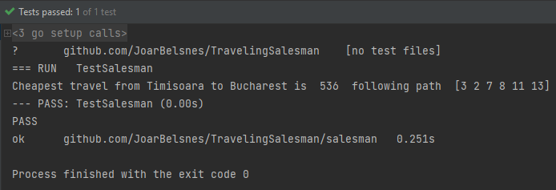

# TravelingSalesman

For this task i used the dijkstra framework to help me complete the assignment. 
I added a test file (dijkstra_salesman_test) which runs the dijkstra algorithm on the cheapest way from Timisoara to Bucharest.
I could not do benchmark tests because I only implemented one algorithm to my program, where in this task it was only required to algorithms for especially interested students.
I will try to add a second algorithm in the branch "" but it isn't sure if it going to be finished.

Test result of dijkstra algorithm of the TravelingSalesman problem
